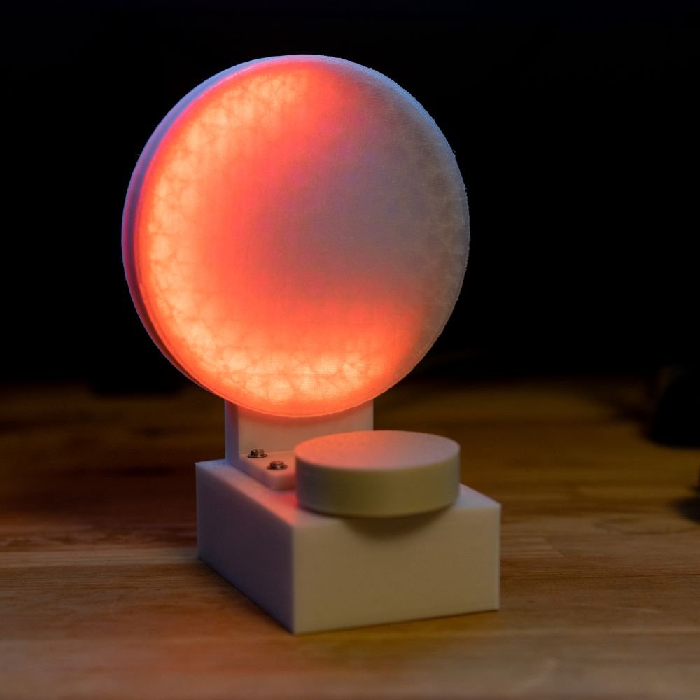

# Pomodoro Clock with ESP32 and WS2811 LEDs

Simple pomodoro clock with light feedback.

## Features

* 25 minute work period, 5 minute break
* auto pauses at the end of a period
* slow pulse while paused
* low brightness pulse if inactive for 1h
* reset and sleep with >2s button press
* configurable by >.7s button press
* configurable break display (entire dial or same proportion as work time)
* configurable top led blinking while running
* configurable brightness

## Bill of materials

* ESP32 board (I used NodeMCU) - check mounting holes
* Rotary encoder without breakout
* WS2812 RGB Led Strip with 144 LEDs/m - 50 LEDs

WS2812 soldered to +5V, GND, and D13
Button (on encoder) soldered to GND and D15
Encoder soldered to GND, D16, D17

## Printing

Printed in PETG with 30% infill for heft and sturdiness, 3 wall layers. `clock_face_interior` printed with 10% infill and transparent PETG, but white PETG was translucent enough to work. Dial was printed with 100% infill for rotational inertia.
